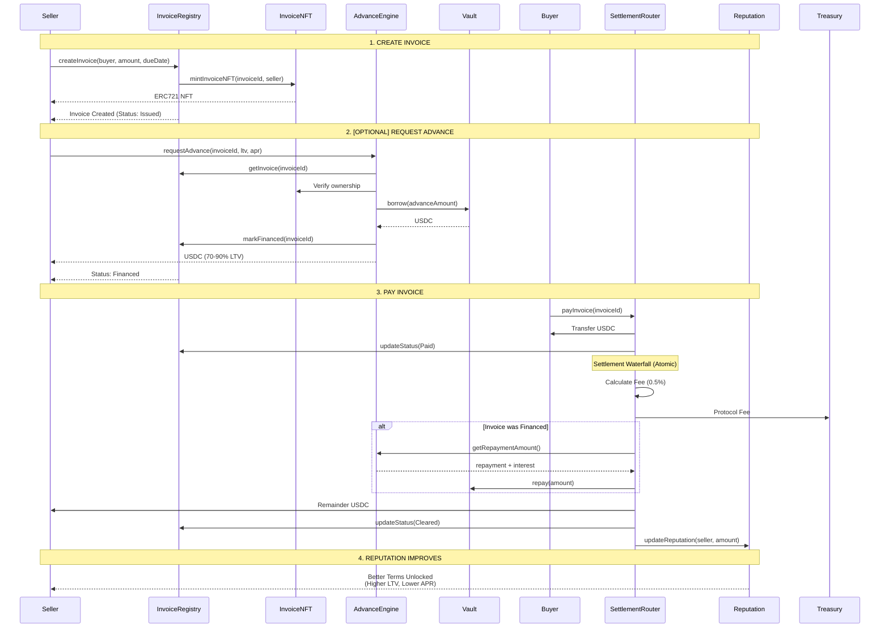
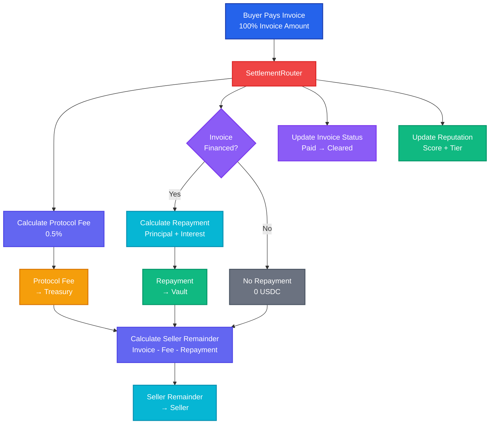

# Monaris

**Monaris** is private programmable neo-finance for the stablecoin era, using cashflow to unlock spending, credit, BNPL, and financial automation on PayFi rails. Businesses get paid in stablecoins, unlock instant financing against invoices and cashflows, shield payments with RAILGUN privacy, swap cross-chain via Across Protocol, and build on-chain reputation that improves terms over time.


For a detailed introduction, see [INTRO.md](./INTRO.md).

---

## 🏗️ Architecture

### System Overview

```mermaid
graph TB
    subgraph "User Layer"
        Seller["👤 Seller (Business)"]
        Buyer["👤 Buyer (Customer)"]
        LP["💰 Liquidity Provider"]
        Admin["⚙️ Protocol Admin / Treasury"]
    end

    subgraph "Frontend Layer"
        React["⚛️ React + TypeScript + Vite"]
        Privy["🔐 Privy (Embedded Wallets)"]
        Wagmi["🔗 Wagmi / Viem (Web3 Hooks)"]
        Reclaim["🔒 Reclaim Protocol (zkTLS Proofs)"]
        Railgun["🛡️ RAILGUN (Private Payments)"]
        Across["🌉 Across Protocol (Cross-chain Swaps)"]

        React --> Privy
        React --> Wagmi
        React --> Reclaim
        React --> Railgun
        React --> Across
    end

    subgraph "Backend Layer"
        Server["🖥️ Express + Prisma (Financing Server)"]
        Supabase["🗄️ Supabase (Metadata / Notifications)"]
        Onramp["💳 Onramp.money (Fiat Rails)"]

        Server --> Supabase
    end

    subgraph "Arbitrum (Smart Contracts)"
        subgraph "Invoice System"
            InvoiceRegistry["📋 InvoiceRegistry"]
            InvoiceNFT["🎨 InvoiceNFT (ERC-721)"]
            InvoiceRegistry -->|Mints| InvoiceNFT
        end

        subgraph "Financing System"
            Vault["🏦 Vault (USDC Pool)"]
            USMTPlus["🪙 USMT+ (ERC-20 Receipt)"]
            Staking["📊 Staking (sUSMT+ Yield)"]
            AdvanceEngine["⚡ AdvanceEngine"]
            CashflowEngine["💹 CashflowEngine"]

            Vault -->|Mints 1:1| USMTPlus
            USMTPlus -->|Stake| Staking
            AdvanceEngine -->|Borrows| Vault
            AdvanceEngine -.->|Collateral| InvoiceNFT
            CashflowEngine -->|Borrows| Vault
        end

        subgraph "Settlement System"
            SettlementRouter["💸 SettlementRouter (Waterfall)"]
            RepaymentRouter["🔄 RepaymentRouter"]
            Reputation["⭐ Reputation (Credit Score)"]

            SettlementRouter -->|Updates| InvoiceRegistry
            SettlementRouter -->|Updates| Reputation
            SettlementRouter -->|Repays| Vault
        end
    end

    Seller -->|Creates Invoice| React
    Buyer -->|Pays Invoice| React
    LP -->|Deposits / Stakes| React
    Admin -->|Manages| React

    React -->|Web3 Calls| InvoiceRegistry
    React -->|Web3 Calls| Vault
    React -->|Web3 Calls| AdvanceEngine
    React -->|Web3 Calls| SettlementRouter
    React -->|API Calls| Server

    style Seller fill:#2563eb,stroke:#1e40af,stroke-width:2px,color:#fff
    style Buyer fill:#2563eb,stroke:#1e40af,stroke-width:2px,color:#fff
    style LP fill:#f59e0b,stroke:#d97706,stroke-width:2px,color:#fff
    style Admin fill:#dc2626,stroke:#b91c1c,stroke-width:2px,color:#fff
    style React fill:#6366f1,stroke:#4f46e5,stroke-width:2px,color:#fff
    style Privy fill:#8b5cf6,stroke:#7c3aed,stroke-width:2px,color:#fff
    style Wagmi fill:#8b5cf6,stroke:#7c3aed,stroke-width:2px,color:#fff
    style Reclaim fill:#8b5cf6,stroke:#7c3aed,stroke-width:2px,color:#fff
    style Railgun fill:#8b5cf6,stroke:#7c3aed,stroke-width:2px,color:#fff
    style Across fill:#8b5cf6,stroke:#7c3aed,stroke-width:2px,color:#fff
    style Server fill:#14b8a6,stroke:#0d9488,stroke-width:2px,color:#fff
    style Supabase fill:#14b8a6,stroke:#0d9488,stroke-width:2px,color:#fff
    style Onramp fill:#14b8a6,stroke:#0d9488,stroke-width:2px,color:#fff
    style InvoiceRegistry fill:#10b981,stroke:#059669,stroke-width:2px,color:#fff
    style InvoiceNFT fill:#10b981,stroke:#059669,stroke-width:2px,color:#fff
    style Vault fill:#f59e0b,stroke:#d97706,stroke-width:2px,color:#fff
    style USMTPlus fill:#f59e0b,stroke:#d97706,stroke-width:2px,color:#fff
    style Staking fill:#06b6d4,stroke:#0891b2,stroke-width:2px,color:#fff
    style AdvanceEngine fill:#f59e0b,stroke:#d97706,stroke-width:2px,color:#fff
    style CashflowEngine fill:#f59e0b,stroke:#d97706,stroke-width:2px,color:#fff
    style SettlementRouter fill:#ef4444,stroke:#dc2626,stroke-width:2px,color:#fff
    style RepaymentRouter fill:#ef4444,stroke:#dc2626,stroke-width:2px,color:#fff
    style Reputation fill:#06b6d4,stroke:#0891b2,stroke-width:2px,color:#fff
```



### Invoice Lifecycle Flow



### Liquidity Provider Flow

```mermaid
flowchart LR
    Start([LP Starts]) --> Deposit["Deposit USDC<br/>to Vault"]
    Deposit --> Receive["Receive USMT+<br/>1:1 Receipt Token"]

    Receive --> Choice{Stake?}
    Choice -->|Yes| Stake[Stake USMT+]
    Choice -->|No| Hold["Hold USMT+<br/>Liquid Position"]

    Stake --> ReceiveStake["Receive sUSMT+<br/>Staked Token"]
    ReceiveStake --> Earn["Earn 15-25% APY<br/>From Borrower Repayments"]

    Hold --> EarnSimple["Earn from<br/>Vault Utilization"]

    Earn --> WithdrawStake[Unstake sUSMT+]
    EarnSimple --> Withdraw[Withdraw USDC]
    WithdrawStake --> Withdraw

    Withdraw --> Burn["Burn USMT+<br/>Receive USDC"]
    Burn --> End([Exit])

    style Start fill:#6b7280,stroke:#4b5563,stroke-width:2px,color:#fff
    style Deposit fill:#10b981,stroke:#059669,stroke-width:2px,color:#fff
    style Receive fill:#f59e0b,stroke:#d97706,stroke-width:2px,color:#fff
    style Choice fill:#6366f1,stroke:#4f46e5,stroke-width:2px,color:#fff
    style Stake fill:#06b6d4,stroke:#0891b2,stroke-width:2px,color:#fff
    style Hold fill:#8b5cf6,stroke:#7c3aed,stroke-width:2px,color:#fff
    style ReceiveStake fill:#06b6d4,stroke:#0891b2,stroke-width:2px,color:#fff
    style Earn fill:#ef4444,stroke:#dc2626,stroke-width:2px,color:#fff
    style EarnSimple fill:#f59e0b,stroke:#d97706,stroke-width:2px,color:#fff
    style WithdrawStake fill:#6366f1,stroke:#4f46e5,stroke-width:2px,color:#fff
    style Withdraw fill:#2563eb,stroke:#1e40af,stroke-width:2px,color:#fff
    style Burn fill:#10b981,stroke:#059669,stroke-width:2px,color:#fff
    style End fill:#6b7280,stroke:#4b5563,stroke-width:2px,color:#fff
```



### Settlement Waterfall



---

## ⚡ Quick Start

```bash
# 1. Clone the repository
git clone https://github.com/Monaris-co/monaris-stg.git
cd monaris-stg

# 2. Install dependencies
npm install

# 3. Set up environment variables
cp .env.example .env  # Fill in your values

# 4. Start development server (frontend + financing server)
npm run dev
```

The development server will start on `http://localhost:8080`

---

## 📋 Detailed Setup Instructions

### Step 1: Clone Repository

```bash
git clone https://github.com/Monaris-co/monaris-stg.git
cd monaris-stg
```

### Step 2: Install Dependencies

```bash
npm install
```

This installs:
- **Frontend**: React 18, Vite, TypeScript, Wagmi v3, Viem, Framer Motion, Radix UI, TailwindCSS
- **Smart Contracts**: Hardhat, Ethers.js v6, OpenZeppelin v5
- **Privacy**: RAILGUN Wallet SDK, snarkjs (zero-knowledge proofs)
- **Cross-chain**: Across Protocol swap integration, 0x API
- **Backend**: Express v5, Prisma ORM, jose (JWT), node-cron

### Step 3: Environment Configuration

Create a `.env` file in the root directory:

```bash
cp .env.example .env
```

**Required Environment Variables:**

| Variable | Description | Source |
|---|---|---|
| `VITE_PRIVY_APP_ID` | Main app embedded wallet auth | [Privy Dashboard](https://dashboard.privy.io/) |
| `VITE_PAYMENT_PRIVY_APP_ID` | Buyer payment page auth (separate app) | [Privy Dashboard](https://dashboard.privy.io/) |
| `VITE_DEFAULT_CHAIN_ID` | Default chain (`42161` for Arbitrum One) | — |
| `DEPLOYER_MNEMONIC_ARB` | Deployer mnemonic for Arbitrum | Your wallet |
| `VITE_SUPABASE_URL` | Supabase project URL | [Supabase](https://supabase.com/) |
| `VITE_SUPABASE_ANON_KEY` | Supabase anon key | [Supabase](https://supabase.com/) |

**Optional Environment Variables:**

| Variable | Description |
|---|---|
| `VITE_RECLAIM_APP_ID` / `VITE_RECLAIM_APP_SECRET` | zkTLS proofs via Reclaim Protocol |
| `VITE_PRIVATE_PAYMENTS_ENABLED` | Enable RAILGUN private payments (`true`/`false`) |
| `VITE_ACROSS_API_KEY` | Across Protocol cross-chain swaps |
| `VITE_ZEROX_API_KEY` | 0x API for same-chain swaps |
| `VITE_ONRAMP_APP_ID` | Onramp.money fiat on/off-ramp |
| `VITE_RPC_URL_42161` | Custom Arbitrum RPC endpoint |

Contract addresses are populated after deployment — see `.env.example` for the full list.

**Important:** Never commit your `.env` file to version control. It's already in `.gitignore`.

### Step 4: Get Testnet ETH (for Testnet Deployment)

For Arbitrum Sepolia testnet:

1. Get testnet ETH from [Arbitrum Faucet](https://faucet.arbitrum.io/)
2. Add Arbitrum Sepolia to your wallet:
   - **Network Name:** Arbitrum Sepolia
   - **RPC URL:** `https://sepolia-rollup.arbitrum.io/rpc`
   - **Chain ID:** `421614`
   - **Currency Symbol:** ETH
   - **Block Explorer:** `https://sepolia-explorer.arbitrum.io`

---

## 🏗️ Smart Contract Deployment

### Supported Networks

| Network | Chain ID | Command |
|---|---|---|
| Arbitrum One (Mainnet) | 42161 | `npm run deploy:arbitrum-mainnet` |
| Arbitrum Sepolia | 421614 | `npm run deploy:arbitrum-sepolia` |
| Mantle Sepolia | 5003 | `npm run deploy:mantle-sepolia` |
| Mantle Mainnet | 5000 | `npm run deploy:mantle-mainnet` |
| Ethereum Sepolia | 11155111 | `npm run deploy:eth-sepolia` |
| Ethereum Mainnet | 1 | `npm run deploy:eth-mainnet` |

### Deploy All Contracts

```bash
# Compile contracts
npm run compile

# Deploy to Arbitrum Mainnet (primary)
npm run deploy:arbitrum-mainnet

# Or deploy to testnet
npm run deploy:arbitrum-sepolia
```

**What gets deployed (13 contracts):**

1. **DemoUSDC** — Test stablecoin (testnet) / uses native USDC on mainnet
2. **InvoiceNFT** — ERC-721 tokenized invoices
3. **InvoiceRegistry** — Invoice creation and state machine
4. **Vault** — Liquidity pool for invoice financing
5. **USMTPlus** — ERC-20 receipt token (1:1 with USDC deposits)
6. **Staking** — sUSMT+ yield positions (15-25% APY)
7. **AdvanceEngine** — Instant invoice financing
8. **CashflowEngine** — Cashflow-based financing
9. **CashflowOracle** — On-chain cashflow data oracle
10. **CashflowVault** — Dedicated cashflow liquidity
11. **RepaymentRouter** — Automated repayment routing
12. **Reputation** — On-chain credit scoring (Tier A/B/C)
13. **SettlementRouter** — Atomic payment waterfall

**Deployment Output:**

The script will:
- Deploy all contracts in dependency order
- Configure roles and permissions (AccessControl)
- Save addresses to `contracts-{chainId}.json`
- Output environment variables for `.env`

```
✅ Deployment complete!

Contract addresses saved to: contracts-42161.json

VITE_INVOICE_NFT_ADDRESS=0x...
VITE_INVOICE_REGISTRY_ADDRESS=0x...
VITE_VAULT_ADDRESS=0x...
VITE_ADVANCE_ENGINE_ADDRESS=0x...
VITE_REPUTATION_ADDRESS=0x...
VITE_SETTLEMENT_ROUTER_ADDRESS=0x...
```

Copy these addresses to your `.env` file.

### Verify Contracts

```bash
# Set your Arbiscan API key in .env
ARBISCAN_API_KEY=your_api_key

# Verify contracts
npm run verify
```

For multichain deployment details, see [MULTICHAIN_SETUP.md](./MULTICHAIN_SETUP.md).

---

## 🖥️ Frontend & Server

### Development Mode

```bash
# Start both frontend + financing server
npm run dev

# Or start frontend only
npm run dev:frontend

# Or start server only
npm run server:dev
```

The frontend starts on `http://localhost:8080` with Vite HMR.

### Production Build

```bash
# Build for production
npm run build

# Preview production build
npm run preview
```

### Backend Server

The financing server (`server/`) is a separate Express + Prisma application:

```bash
# Database setup (PostgreSQL)
npm run db:local:up         # Start local PostgreSQL via Docker
npm run db:local:push       # Push Prisma schema

# Run server
npm run server:dev
```

**Server features:**
- Cashflow income detection & pattern analysis
- Eligibility underwriting engine
- Oracle submission for on-chain cashflow data
- Alchemy sync for wallet transfer indexing
- RAILGUN quicksync proxy
- Admin + financing REST API

---

## 📚 Architecture Overview

### Smart Contracts

```
contracts/
├── InvoiceRegistry.sol      — Invoice creation & state management
├── InvoiceNFT.sol           — ERC-721 tokenized invoices
├── Vault.sol                — USDC liquidity pool
├── USMTPlus.sol             — ERC-20 receipt token (1:1)
├── Staking.sol              — sUSMT+ staked yield positions
├── AdvanceEngine.sol        — Invoice-backed instant financing
├── CashflowEngine.sol       — Cashflow-backed financing
├── CashflowOracle.sol       — On-chain cashflow oracle
├── CashflowVault.sol        — Cashflow liquidity pool
├── RepaymentRouter.sol      — Automated repayment routing
├── SettlementRouter.sol     — Atomic payment waterfall
├── Reputation.sol           — On-chain credit scoring
├── DemoUSDC.sol             — Test stablecoin (testnet only)
├── interfaces/              — Contract interfaces
└── mocks/                   — Test mocks
```

### Frontend Pages

```
src/pages/app/
├── Dashboard.tsx            — Balance overview, stats, quick send
├── Invoices.tsx             — Invoice list & management
├── CreateInvoice.tsx        — Invoice creation form
├── InvoiceDetail.tsx        — Single invoice view + actions
├── Financing.tsx            — Invoice & cashflow financing
├── Vault.tsx                — LP deposit, USMT+, staking
├── PrivatePayments.tsx      — RAILGUN shield/unshield/pay
├── Swap.tsx                 — Cross-chain & same-chain swaps
├── Reputation.tsx           — Credit score & tier progress
├── Proofs.tsx               — zkTLS proof generation
├── Activity.tsx             — Transaction history
└── Settings.tsx             — App configuration & demo setup
```

### Backend (Financing Server)

```
server/src/
├── routes/
│   ├── financing.ts         — Financing position CRUD
│   ├── cashflow.ts          — Cashflow analysis endpoints
│   ├── admin.ts             — Admin operations
│   ├── sync.ts              — Wallet transfer sync
│   ├── proxy.ts             — RPC & RAILGUN proxy
│   └── health.ts            — Health check
├── services/
│   ├── income-detection.ts  — Recurring income pattern ML
│   ├── underwriting.ts      — Eligibility & risk scoring
│   ├── oracle-submission.ts — On-chain oracle updates
│   ├── alchemy-sync.ts      — Wallet indexing via Alchemy
│   └── railgun-quicksync.ts — RAILGUN UTXO sync
└── prisma/schema.prisma     — PostgreSQL data model
```

### Tech Stack

| Layer | Technology |
|---|---|
| **Frontend** | React 18, TypeScript, Vite, TailwindCSS, Framer Motion, Radix UI |
| **Web3** | Wagmi v3, Viem, Ethers.js v6, Privy (embedded wallets) |
| **Smart Contracts** | Solidity 0.8.24, Hardhat, OpenZeppelin v5 |
| **Privacy** | RAILGUN Wallet SDK, snarkjs |
| **Cross-chain** | Across Protocol (bridge swaps), 0x API (same-chain swaps) |
| **Backend** | Express v5, Prisma ORM, PostgreSQL |
| **Off-chain Data** | Supabase (metadata, notifications, contacts) |
| **Proofs** | Reclaim Protocol (zkTLS) |
| **Fiat Rails** | Onramp.money |
| **Deployment** | Vercel (frontend), Railway/Docker (server) |

---

## 🧪 Testing the Complete Flow

1. **Deploy Contracts:**
   ```bash
   npm run deploy:arbitrum-sepolia
   ```

2. **Start Frontend + Server:**
   ```bash
   npm run dev
   ```

3. **Fund Wallets:**
   - Use Settings → Demo Setup to mint DemoUSDC
   - Fund test wallets via faucet

4. **Test Invoice Flow:**
   - Create invoice as Seller → share payment link
   - Request advance (optional) → receive USDC instantly
   - Pay invoice as Buyer via payment link
   - Verify atomic settlement waterfall (fee → vault repay → seller)

5. **Test Privacy:**
   - Shield USDC into RAILGUN (private balance)
   - Send private payment to recipient
   - Unshield back to public wallet

6. **Test Swaps:**
   - Cross-chain swap via Across Protocol
   - Same-chain swap via 0x API

---

## 🔐 Security Considerations

### For Users

- **Non-Custodial:** Monaris does not hold user funds; all transactions are on-chain
- **Smart Contracts:** All contracts use OpenZeppelin v5 libraries and role-based access control
- **Privacy:** RAILGUN integration uses zero-knowledge proofs for shielded transactions
- **Audits:** Contracts should be audited before mainnet deployment

### For Developers

- **Private Keys:** Never commit private keys or mnemonics to version control
- **Environment Variables:** Keep `.env` secure and never share it
- **Contract Upgrades:** Current contracts are immutable (not upgradeable)
- **Access Control:** Uses OpenZeppelin's `AccessControl` for role-based permissions
- **CORS:** Vercel headers configured for `Cross-Origin-Opener-Policy` and `Cross-Origin-Embedder-Policy` (required for WASM/RAILGUN)

---

## 🤝 Contributing

Monaris is in active development. To contribute:

1. Fork the repository
2. Create a feature branch (`git checkout -b feature/your-feature`)
3. Make your changes
4. Test thoroughly
5. Submit a pull request

---

## 📄 License

© 2025 Monaris. All rights reserved.

---

## 🌐 Learn More

- **Introduction:** See [INTRO.md](./INTRO.md) for project overview and pitch
- **Architecture:** See [architecture.md](./architecture.md) for detailed system design
- **Multichain:** See [MULTICHAIN_SETUP.md](./MULTICHAIN_SETUP.md) for cross-chain deployment
- **Contact:** Telegram @Adityaakrx | Twitter @adityakrx

